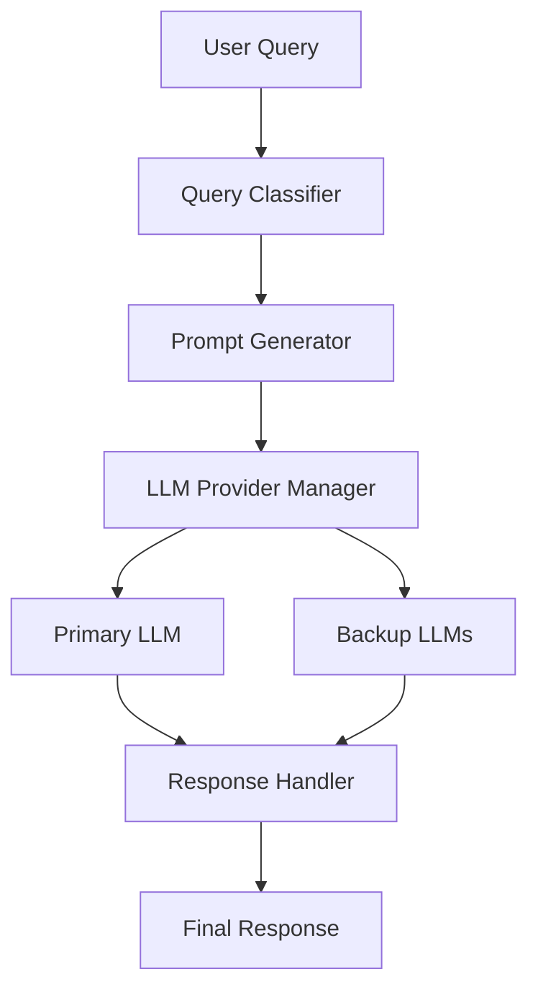
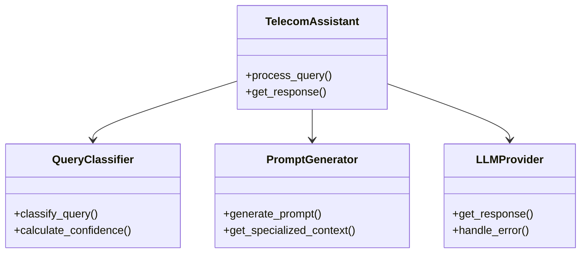
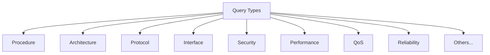
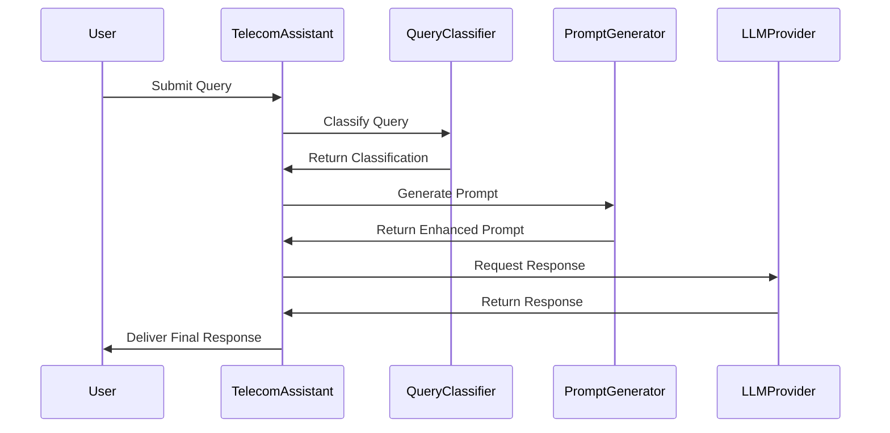
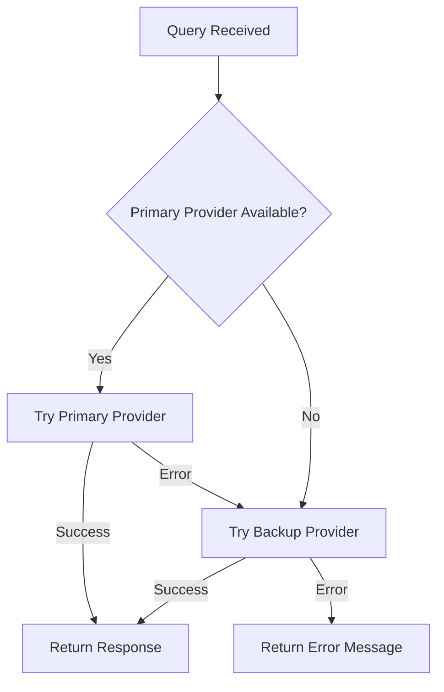

# 3GPP Telecom Assistant Technical Design Document
Version 1.0 | January 2025

## Table of Contents
1. [System Overview](#1-system-overview)
2. [Architecture Components](#2-architecture-components)
3. [Data Flow](#3-data-flow)
4. [Component Details](#4-component-details)
5. [Integration Examples](#5-integration-examples)
6. [Error Handling](#6-error-handling)

## 1. System Overview

### 1.1 Purpose
The 3GPP Telecom Assistant is a specialized system designed to process and answer telecommunications standard queries using multiple Language Learning Models (LLMs) with domain-specific knowledge enhancement.

### 1.2 High-Level Architecture


## 2. Architecture Components

### 2.1 Core Components


### 2.2 Query Types


## 3. Data Flow

### 3.1 Query Processing Flow


## 4. Component Details

### 4.1 Query Classifier Implementation
```python
class QueryClassifier:
    def classify_query(self, query: str) -> QueryClassification:
        # Example implementation
        query_lower = query.lower()
        keyword_matches = self._find_keyword_matches(query_lower)
        confidence = self._calculate_confidence(keyword_matches)
        
        return QueryClassification(
            primary_type=self._determine_primary_type(keyword_matches),
            secondary_types=self._determine_secondary_types(keyword_matches),
            confidence_score=confidence,
            keywords_matched=keyword_matches
        )
```

### 4.2 Prompt Generator Example
```python
class PromptGenerator:
    def generate_prompt(self, query: str, classification: QueryClassification) -> str:
        base_context = self._get_base_context()
        specialized_context = self._get_specialized_context(classification)
        
        return f"""
        {base_context}
        
        Specialized Context:
        {specialized_context}
        
        User Query: {query}
        
        Please provide a detailed response focusing on {classification.primary_type.value}
        aspects while considering {', '.join(t.value for t in classification.secondary_types)}.
        """
```

## 5. Integration Examples

### 5.1 Basic Usage
```python
# Initialize the assistant
assistant = TelecomAssistant(
    primary_provider=OpenAIProvider(api_key="your-key"),
    backup_providers=[
        AnthropicProvider(api_key="your-key"),
        MistralProvider(api_key="your-key")
    ]
)

# Process a simple query
query = "Explain the 5G registration procedure"
response = assistant.process_query(query)
print(response)
```

### 5.2 Advanced Usage with Custom Configuration
```python
# Configure with custom settings
config = {
    'confidence_threshold': 0.7,
    'max_retries': 3,
    'cache_enabled': True,
    'cache_ttl': 3600
}

assistant = TelecomAssistant.with_config(
    config=config,
    primary_provider=OpenAIProvider(api_key="your-key"),
    backup_providers=[AnthropicProvider(api_key="your-key")]
)

# Process batch queries
queries = [
    "Explain 5G network slicing",
    "Detail the N2 interface",
    "Describe QoS flow handling"
]

for query in queries:
    response = assistant.process_query(query)
    print(f"Query: {query}\nResponse: {response}\n")
```

### 5.3 API Integration Example
```python
from fastapi import FastAPI
from pydantic import BaseModel

app = FastAPI()
assistant = TelecomAssistant(...)

class Query(BaseModel):
    text: str
    preferences: dict = {}

@app.post("/query")
async def process_query(query: Query):
    response = assistant.process_query(
        query.text,
        preferences=query.preferences
    )
    return {"response": response}
```

## 6. Error Handling

### 6.1 Error Handling Flow


### 6.2 Error Handling Implementation
```python
class TelecomAssistant:
    def _handle_provider_error(self, error: Exception, query: str) -> str:
        error_type = type(error).__name__
        
        if error_type in ['RateLimitError', 'QuotaExceededError']:
            return self._try_backup_providers(query)
        elif error_type in ['AuthenticationError', 'InvalidAPIKeyError']:
            self._log_critical_error(error)
            raise SystemError("Authentication failed")
        else:
            self._log_error(error)
            return "An error occurred. Please try again later."

    def _try_backup_providers(self, query: str) -> str:
        for provider in self.backup_providers:
            try:
                return provider.get_response(query)
            except Exception as e:
                continue
        return "All providers failed. Please try again later."
```

## Usage Examples

### Example 1: Basic Query Processing
```python
# Initialize the assistant
assistant = TelecomAssistant(
    primary_provider=OpenAIProvider(api_key="your-key")
)

# Process a simple query
query = "Explain the 5G registration procedure"
response = assistant.process_query(query)

# Output will include:
# 1. Query classification
# 2. Confidence score
# 3. Detailed response with 3GPP references
```

### Example 2: Advanced Query with Preferences
```python
# Process query with specific preferences
response = assistant.process_query(
    query="Detail 5G security architecture",
    preferences={
        'response_format': 'detailed',
        'include_references': True,
        'focus_areas': ['authentication', 'encryption']
    }
)
```

### Example 3: Batch Processing with Error Handling
```python
queries = [
    "Explain 5G network slicing",
    "Detail the N2 interface",
    "Describe QoS flow handling"
]

results = []
for query in queries:
    try:
        response = assistant.process_query(query)
        results.append({
            'query': query,
            'status': 'success',
            'response': response
        })
    except Exception as e:
        results.append({
            'query': query,
            'status': 'error',
            'error': str(e)
        })
```

### Example 4: Web Service Integration
```python
from fastapi import FastAPI
from pydantic import BaseModel

app = FastAPI()
assistant = TelecomAssistant(...)

class QueryRequest(BaseModel):
    query: str
    preferences: dict = {}

@app.post("/api/telecom/query")
async def handle_query(request: QueryRequest):
    try:
        response = assistant.process_query(
            request.query,
            preferences=request.preferences
        )
        return {
            "status": "success",
            "response": response
        }
    except Exception as e:
        return {
            "status": "error",
            "error": str(e)
        }
```

Would you like me to:
1. Add more detailed examples?
2. Expand any specific component's documentation?
3. Include additional error handling scenarios?
4. Add more integration patterns?